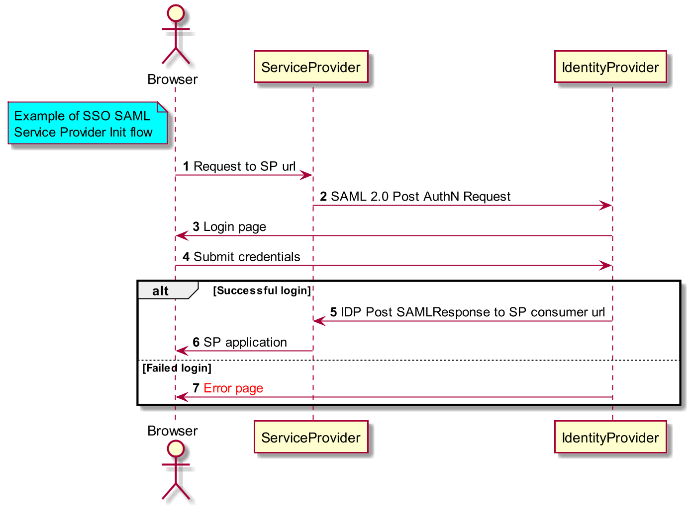
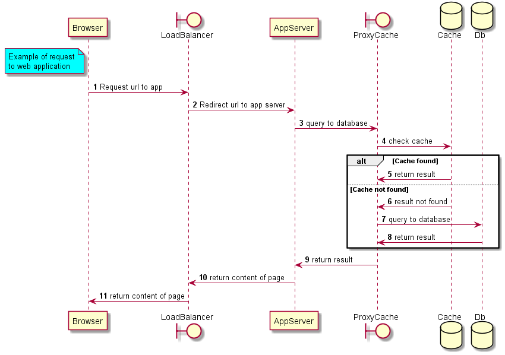
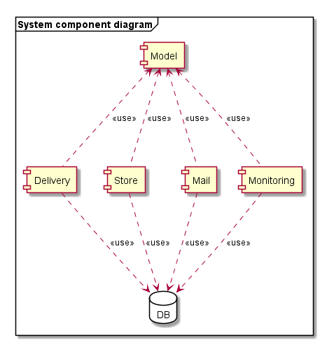
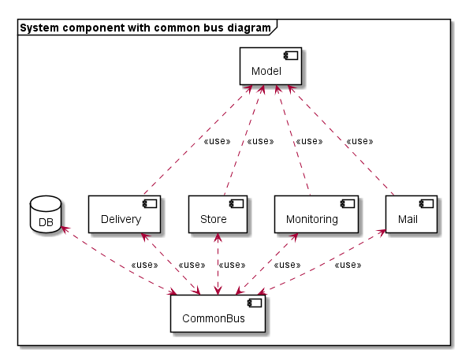
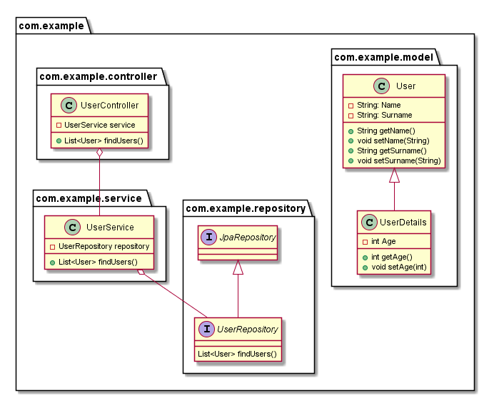
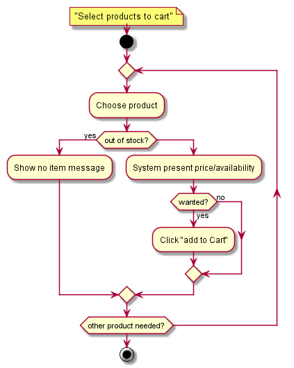
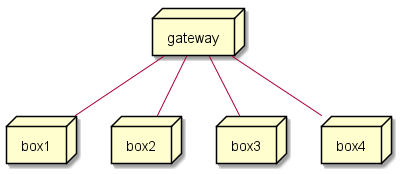
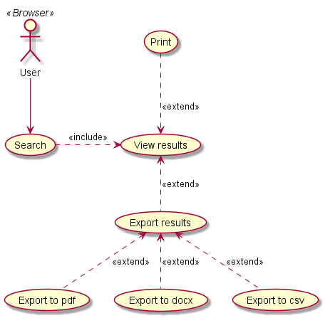

# Examples of diagrams generated using plantuml
:toc:

## Sequence

### Sso flow

### Request to web page

## Component

### System component example

### System component example with additional component

## Class

## Activity

## Deployment

## Usecase
